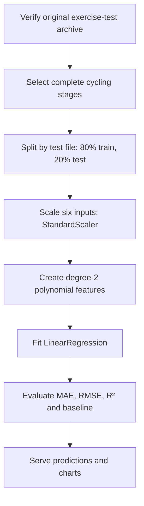
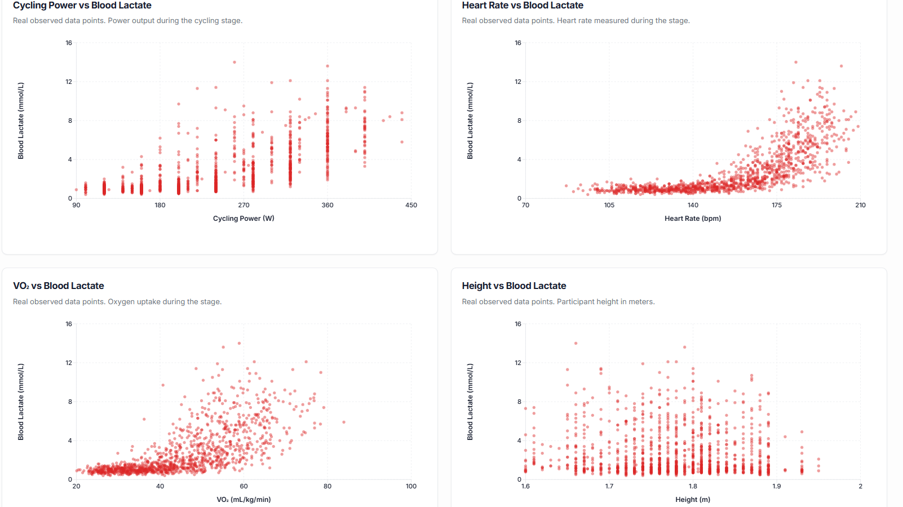
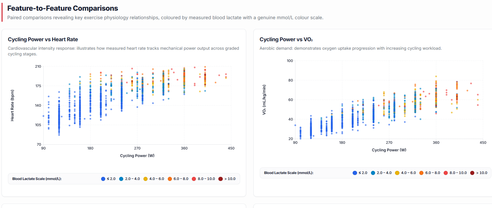
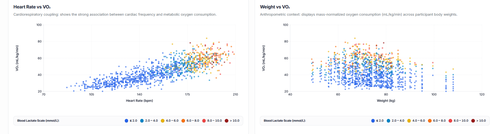
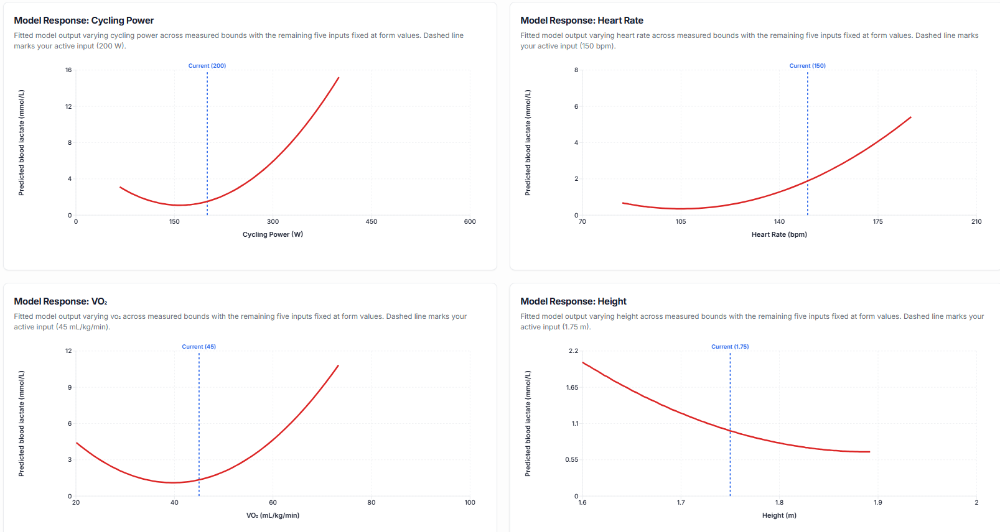
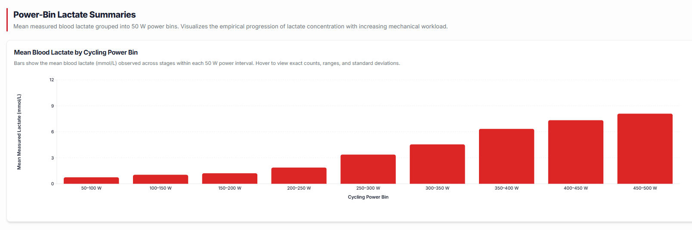
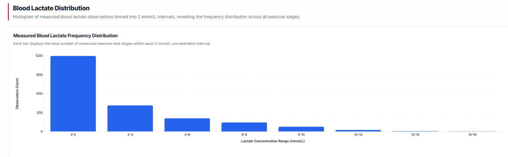
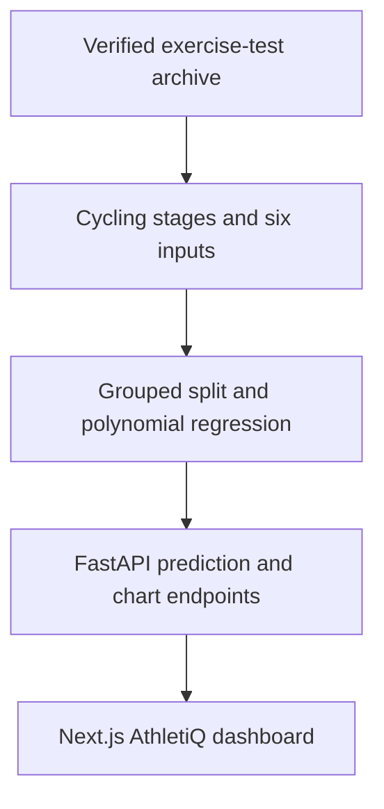

# AthletiQ

### Polynomial Regression for Cycling Blood Lactate Estimation

AthletiQ is a full-stack machine-learning application that estimates **blood lactate concentration (mmol/L)** from six inputs collected in graded cycling exercise tests. It combines **degree-2 polynomial curve fitting**, a FastAPI backend, and an interactive Next.js dashboard.

AthletiQ models how blood lactate responds to cycling power, giving athletes and coaches a way to explore exercise intensity and physiological response. It does not directly predict race results or overall athletic performance.

> Predictions describe patterns across the source tests. They are not individualized lactate thresholds, diagnoses, or training prescriptions.

---

## Project Highlights

- Real graded exercise-test data published by the Trinity College Dublin Human Performance Laboratory.
- **2,065** complete cycling stage observations from **276** test files for the six-input model.
- Six inputs: power, heart rate, VO₂, height, weight, and age.
- Degree-2 polynomial features, including squared terms and pairwise interactions.
- Grouped 80/20 split by test file: **1,645 training** and **420 held-out** stage observations.
- Fair comparison with a power-only quadratic model using the **same rows and split**.
- Live prediction and interactive real-data charts through FastAPI, Next.js, and Recharts.

---

## Dataset

**Source:** [Donne et al., *Graded Incremental Test Data (Cycling, Running, Kayaking, Rowing)*, Trinity College Dublin Human Performance Laboratory, Zenodo record 10841412](https://zenodo.org/records/10841412).

The original archive is stored at `data/raw/graded_tests.zip`. The six-input loader verifies its published MD5 checksum (`f64cb1bf4d66129daed6c1954ea6ca9f`) and retains cycling stages with all six valid predictors and measured blood lactate. It yields **2,065 real stage observations from 276 test files**. The older power-only export has **2,102 pairs from 279 files**; its counts and metrics refer to a different input subset.

| Item | Six-input dataset |
| --- | ---: |
| Complete measured cycling stages | 2,065 |
| Cycling test files | 276 |
| Training stages | 1,645 |
| Held-out stages | 420 |
| Input variables | 6 |
| Target | Measured blood lactate (mmol/L) |

### Selected Features

| Feature | API field | Unit | Meaning |
| --- | --- | --- | --- |
| Cycling power | `power` | W | Workload at the cycling stage |
| Heart rate | `heart_rate` | bpm | Heart rate measured during the stage |
| Oxygen uptake | `vo2` | mL/kg/min | Mass-normalized VO₂ measured during the stage |
| Height | `height` | m | Participant height |
| Weight | `weight` | kg | Participant body mass |
| Age | `age` | years | Calculated from birth date and test date |

**Prediction target:** `lactate`, measured blood lactate concentration in mmol/L. Scatter-chart points represent genuine dataset measurements.

---

## Machine Learning Pipeline



The split uses `GroupShuffleSplit(test_size=0.2, random_state=42)`, so stages from the same test file do not appear in both partitions. Model fitting and preprocessing use the training partition only; the held-out partition is used for the final evaluation. The power-only baseline uses the same rows and split.

Six input variables expand into **27 model terms**: six first-order values, six squares, and 15 pairwise interactions, plus an intercept learned by linear regression. The model is nonlinear in its input variables while its coefficients are fitted using linear regression.

### Why Polynomial Curve Fitting?

Blood lactate need not rise at a constant rate as exercise intensity changes. Degree-2 polynomial regression captures curvature and interactions among measured inputs. A model-response chart varies one input across its measured range while holding the other five at the current form values. Those curves are **model predictions**, not new lab observations.

---

## Regression Model Comparison

Both models use the **same 2,065 complete observations** and **420 held-out stages** from the same grouped split.

| Model | Inputs | MAE ↓ (mmol/L) | RMSE ↓ (mmol/L) | R² ↑ |
| --- | --- | ---: | ---: | ---: |
| Power-only degree-2 baseline | Power | 1.1214 | 1.6630 | 0.5504 |
| **Six-input degree-2 model** | **All six features** | **0.8633** | **1.2826** | **0.7325** |

The additional measured inputs improved held-out error in this experiment. Test-file IDs have not been verified as unique participant IDs.

---

## Final Model Performance

| Metric | Six-input degree-2 polynomial regression |
| --- | ---: |
| Mean absolute error | **0.8633 mmol/L** |
| Root mean squared error | **1.2826 mmol/L** |
| R² | **0.7325** |
| Held-out stages | **420** |

---

## Visual Analysis

**Scatter plots and histograms show measured data. Polynomial response curves show fitted model outputs.**

### 1. Features vs Blood Lactate

Measured cycling power, heart rate, VO₂, and height compared with measured blood lactate.



### 2. Feature-to-Feature Comparisons

Power versus heart rate and power versus VO₂, colored by measured blood lactate.



### 3. Additional Feature Comparisons

Heart rate versus VO₂ and weight versus VO₂, colored by measured blood lactate.



### 4. Polynomial Model Responses

Predicted lactate when one feature varies and the other five remain at the selected inputs; a dotted line marks the current value.



### 5. Mean Lactate by Cycling Power Bin

Measured mean lactate across 50 W power intervals.



### 6. Blood Lactate Distribution

Frequency of measured stages in 2 mmol/L lactate intervals.



---

## Application

### Prediction

Enter six measurements and obtain a live estimate from the trained model. The prediction view also displays a chart driven by the selected values.

Request to `POST /api/predict/six-input`:

```json
{
  "power": 200,
  "heart_rate": 150,
  "vo2": 45,
  "height": 1.75,
  "weight": 70,
  "age": 30
}
```

Verified example response:

```json
{
  "lactate": 1.113,
  "unit": "mmol/L",
  "model": "Six-input polynomial regression (degree 2)"
}
```

### Feature Explorer

Explore all six inputs with measured feature-versus-lactate plots, feature-to-feature comparisons, and fitted model-response charts.

### Data Insights

Inspect real measured lactate distributions, power-bin averages, and recorded feature ranges.

### How It Works, Polynomial Curve Fitting, and Methodology

Learn how the source is filtered, how quadratic features are fitted, what a prediction means, and where interpretation requires care.

---

## System Architecture



The six-input model is loaded and fitted once per running API process, then reused in memory. The six-input implementation does not currently save a trained joblib artifact.

---

## Tech Stack

| Layer | Technologies |
| --- | --- |
| Machine learning | Python, scikit-learn, pandas, NumPy, openpyxl |
| Backend | FastAPI, Uvicorn, Pydantic |
| Frontend | Next.js, React, TypeScript, Tailwind CSS, Recharts |
| Research | Jupyter notebooks and dataset-preparation scripts |

---

## API Endpoints

| Method | Endpoint | Purpose |
| --- | --- | --- |
| `GET` | `/api/health` | Health check |
| `POST` | `/api/predict/six-input` | Predict lactate from all six inputs |
| `GET` | `/api/feature-stats` | Observed input ranges and summary statistics |
| `GET` | `/api/scatter?x=power&y=lactate` | Real measured feature-pair scatter data |
| `POST` | `/api/model-response/{feature}` | Fitted response varying one feature |
| `POST` | `/api/response-curve` | Fitted curve over measured cycling-power range |
| `GET` | `/api/data-insights` | Measured power bins and lactate distribution |
| `GET` | `/api/model-evaluation` | Same-split baseline and six-input metrics |

Interactive API docs: `http://127.0.0.1:8000/docs`. Older single-input routes may still exist for compatibility; the main dashboard prediction uses `/api/predict/six-input`.

---

## Project Structure

```text
AthletiQ/
├── backend/
│   ├── app/
│   │   ├── main.py                 # FastAPI application and router registration
│   │   ├── multivariate.py         # Six-input ML pipeline and API routes
│   │   ├── model.py                # Original power-only model
│   │   └── store.py                # Legacy dataset/model state
│   ├── tests/
│   └── requirements.txt
├── frontend/                       # Current Next.js dashboard
│   ├── app/
│   └── package.json
├── data/
│   ├── raw/graded_tests.zip        # Published research archive
│   └── processed/cycling_lactate.csv
├── docs/
│   ├── DATASET.md
│   └── screenshots/                # Visual Analysis images
├── notebooks/                      # Earlier exploration/modeling notebooks
├── scripts/                        # Source-data preparation
├── .gitignore
└── README.md
```

The current notebooks document the earlier power-only exploration. The six-input model and its held-out evaluation are implemented in `backend/app/multivariate.py`.

---

## Run Locally

From the **AthletiQ project root** in Windows PowerShell:

```powershell
py -m venv .venv
.\.venv\Scripts\python.exe -m pip install -r backend\requirements.txt
.\.venv\Scripts\python.exe -m uvicorn backend.app.main:app --reload
```

Open API docs at `http://127.0.0.1:8000/docs`. In a second PowerShell terminal:

```powershell
cd frontend
npm install
"NEXT_PUBLIC_API_BASE=http://127.0.0.1:8000" | Set-Content .env.local
npm run dev
```

Open the local URL printed by Next.js, usually `http://localhost:3000`, or `3001` if 3000 is already occupied. Keep `.env.local` out of version control. The first model request reads the research archive and fits the model; later requests reuse it in the running process.

---

## Key Result

The **six-input degree-2 polynomial model** achieved **MAE 0.8633 mmol/L, RMSE 1.2826 mmol/L, and R² 0.7325** on 420 stages from held-out cycling test files. On the same split, the power-only quadratic model achieved **MAE 1.1214 mmol/L and R² 0.5504**.

---

## Limitations

AthletiQ estimates blood lactate from patterns in published cycling tests; it does not directly predict race results, overall athletic performance, or an individual's lactate threshold. Inputs must remain within observed feature ranges. Changing one input while fixing the others can create uncommon physiological combinations. Grouping stages by test file prevents within-file train/test leakage, but repeat participants across distinct files have not been ruled out.

**Dataset citation:** Donne et al., Trinity College Dublin Human Performance Laboratory, [Zenodo record 10841412](https://zenodo.org/records/10841412). See [dataset notes](docs/DATASET.md) for provenance and the older power-only experiment.
